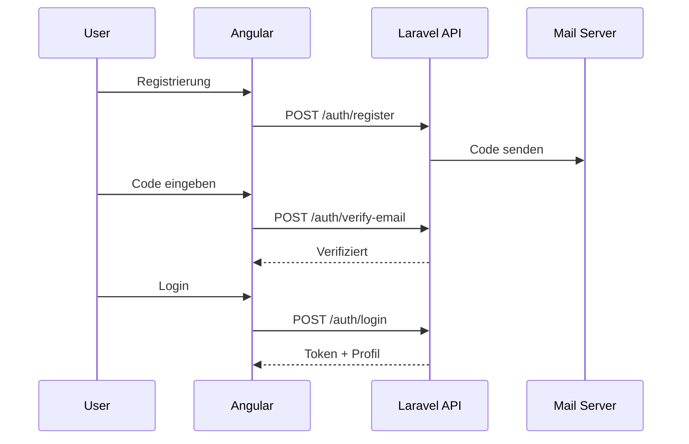
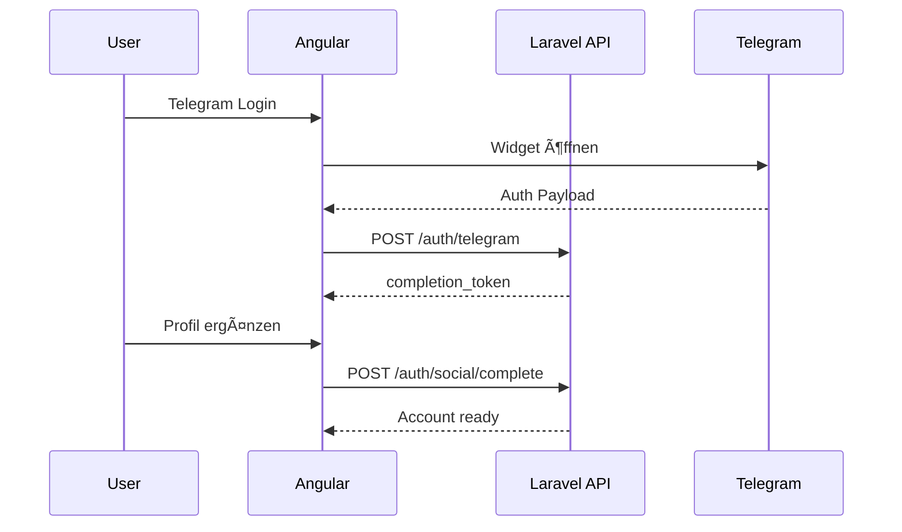
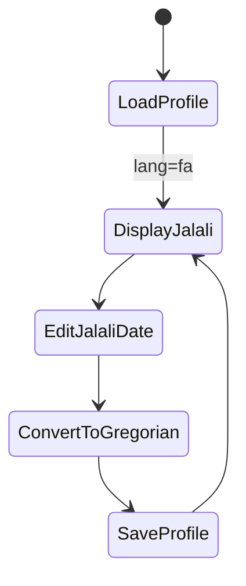

# Projektanforderungen & Architekturleitfaden (DE)

> Hinweis: Dieses Dokument beschreibt die ursprünglichen Anforderungen und das gewünschte Verhalten, nicht spätere Bugfixes oder kleine UI-Anpassungen.

---

## 1) Produktvision
Ein modernes, RTL‑first Workspace fuer allgemeine Verwaltung mit Persisch (fa) als Hauptsprache und Englisch (en) als Zweitsprache. Frontend: Angular (latest) mit PrimeNG + Sakai und Transloco. Backend: Laravel + Sanctum.

## 2) Hauptanforderungen

### 2.1 Sprachen & UI-Richtung
- Hauptsprache: Persisch (RTL).
- Zweitsprache: Englisch (LTR).
- Alle Texte werden über Transloco (Frontend) und Laravel Lang-Files (Backend) lokalisiert.
- HTML `dir` und `lang` werden dynamisch umgeschaltet.
- Datumsanzeige: Jalali für fa, Gregorian für en.
- Ziffern: persisch bei fa, lateinisch bei en.

### 2.2 Design & Theme
- UI-Theme orientiert an den Logo-Farben (logo_fa.png).
- Moderner Workspace im Sakai-Stil.
- Buttons, Verläufe, Rahmen und Inputs folgen dem Theme.

### 2.3 Authentifizierung & Account-Lifecycle
- Login: Benutzername/E-Mail + Passwort.
- Registrierung: E-Mail-Verifizierung (Aktivierungscode).
- Passwort-Reset: Anfrage + Reset (Login kann E-Mail oder Username sein).
- Login gesperrt, wenn E-Mail nicht verifiziert ist (falls vorhanden).
- Social Login: Telegram.
- Social Completion: fehlende Profilfelder müssen ergänzt werden.
- Account-Merge: Telegram-Konto kann mit lokalem Konto verknüpft werden.

### 2.4 Profil & Identität
- Vollständiges Profil anzeigen/bearbeiten (persönliche Daten, Avatar, Telefonnummern, Adressen).
- Avatar Upload/Remove (Drag & Drop).
- Passwortänderung in separatem Modal.
- Social-Provider-Icons im Profil.
- Validierung: Code Meli & SHABA.
- Live-Verfügbarkeit von Username/E-Mail.

### 2.5 Jalali Datum
- Backend speichert Gregorian.
- Frontend konvertiert zu Jalali (fa).
- Eingabe ohne führende Nullen möglich (z. B. 1400/3/8).
- Jalali Monatsregeln:
  - Monate 1–6 = 31 Tage
  - Monate 7–11 = 30 Tage
  - Monat 12 = 29/30 Tage
- Speichern: Jalali → Gregorian.
- Sprachwechsel aktualisiert Datumsanzeige.

### 2.6 Workspace & RBAC
- Rollen/Permissions:
  - Admin: alle Rechte
  - Neue User: Standardrolle Mitglied (Slug: guest)
- CRUD für Users, Roles, Permissions.
- Responsive Sidebar mit Gruppenstruktur und Icons.
- Sidebar unterstützt RTL/LTR, einklappbar am Desktop und Overlay auf Mobile.
- Mobile Header enthält einen Sidebar-Button neben dem Branding und wird beim Scrollen mit Glas-Effekt (Blur) fixiert.
- Tabellen mit Suche, Sortierung, Pagination.
- Create/Edit in Modal, Delete mit Bestätigung.
- Seiten + Sidebar respektieren Berechtigungen.

### 2.7 Notifications & E-Mail
- E-Mails lokalisiert (fa/en).
- Aktivierungscode + Passwort-Reset.
- Admin-erstellte User bekommen Credentials per E-Mail.
- Mailpit für lokale Entwicklung (8025).

---

## 3) Wichtige User Stories (mit Diagrammen)

### 3.1 Registrierung → E-Mail-Verifizierung → Login

### 3.2 Telegram Login → Profil vervollständigen

### 3.3 Profilbearbeitung mit Jalali Datum

---

## 4) Architektur
- Frontend Feature-Struktur: features/auth, features/profile, features/admin, features/dashboard, features/home.
- Core-Schicht: services, guards, utils, interceptors, config.
- Backend: AuthController, ProfileController, UserController + Services (TelegramAuthService, VerificationCodeService, PasswordResetLinkService, ProfilePresenter).

---

## 5) Erweiterung
- Neue Features unter features/{name}.
- API-Services unter core/services.
- Neue Backend-Controller unter Http/Controllers und Services unter app/Services.
- Berechtigungen in Seeder/Role-Setup pflegen und UI/Routes schützen.

