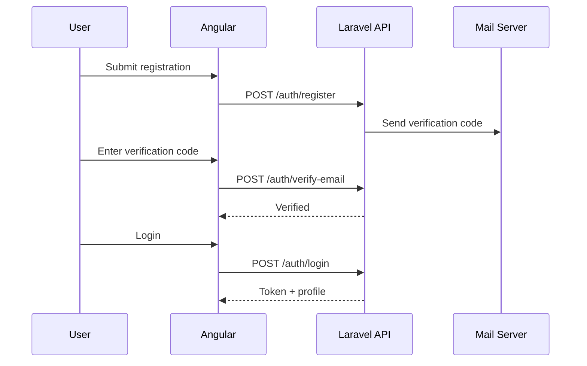
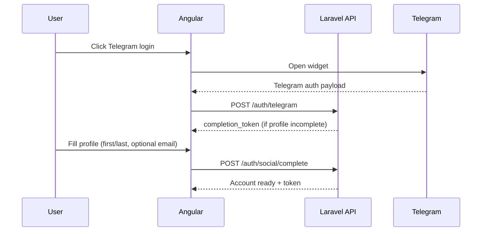
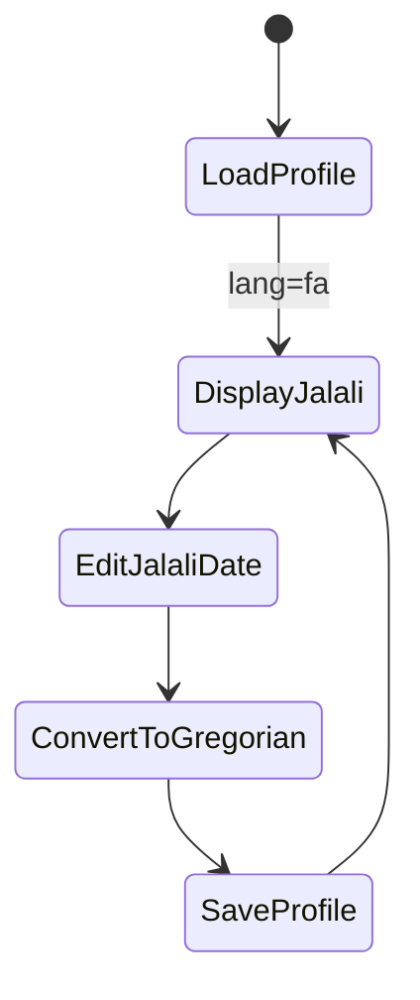
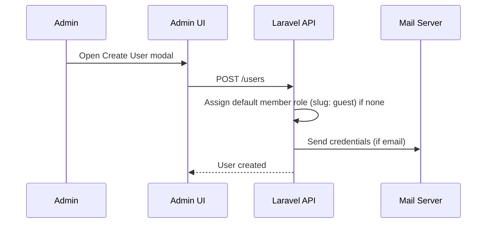

# Project Requirements & Architecture Guide (EN)

> Scope note: This document captures the original project requirements and intended behavior, not subsequent bug fixes or small UI tweaks.

---

## 1) Product Vision
Build a modern, RTL-first workspace for a general management system with Persian (fa) as the primary language and English (en) as the secondary language. The frontend is Angular (latest) with PrimeNG + Sakai Admin Template and Transloco. The backend is Laravel with API-first architecture and Sanctum authentication.

## 2) Core Requirements

### 2.1 Languages & UI Direction
- Primary language: Persian (fa, RTL).
- Secondary language: English (en, LTR).
- All labels/messages must be localized via Transloco (frontend) and Laravel lang files (backend).
- HTML `dir` and `lang` must switch dynamically.
- Date display in Jalali for fa, Gregorian for en.
- Persian numerals for fa display; Latin numerals for en.

### 2.2 Design & Theme
- UI theme aligned with logo colors (logo_fa.png).
- Modern UI/UX workspace, Sakai-based layout.
- Buttons, gradients, borders, and inputs follow the theme system.

### 2.3 Authentication & Account Lifecycle
- Login: username/email + password.
- Registration: email verification required (activation code).
- Password reset: request + reset (login identifier can be email or username).
- Email verification enforced before login if email exists.
- Social login: Telegram.
- Social completion: if social profile is incomplete, user must complete minimal fields.
- Account merge: Telegram account can be linked to existing local account.

### 2.4 Profile & Identity
- Full profile view/edit (personal data, avatar, phone numbers, addresses).
- Avatar upload, remove, drag/drop UI.
- Profile password change via modal.
- Social provider indicators visible on profile.
- Code Meli (Iranian national ID) validation.
- SHABA (IBAN) validation.
- Username and email uniqueness checks (live availability).

### 2.5 Jalali Date Requirements
- Backend stores dates as Gregorian.
- Frontend converts to Jalali for fa display.
- User input may omit leading zeros (e.g., 1400/3/8).
- Jalali calendar must use Jalali month rules:
  - Months 1–6 = 31 days
  - Months 7–11 = 30 days
  - Month 12 = 29/30 days
- When saving: Jalali → Gregorian conversion.
- When switching language: display date changes accordingly.

### 2.6 Workspace & RBAC
- Roles and permissions:
  - Admin: all permissions
  - New users: default member role (slug: guest)
- Admin CRUD for:
  - Users
  - Roles
  - Permissions
- Responsive sidebar with grouped menus and icons.
- Sidebar supports RTL/LTR, collapses on desktop, overlays on mobile.
- Mobile header includes a sidebar toggle button next to the brand and becomes fixed with a glass (blur) effect on scroll.
- Sidebar implemented with custom CSS (no Material/UI framework dependency).
- Admin list/table UX:
  - Search, sort, pagination
  - Create/Edit in modal
  - Delete confirmation dialog
  - Role permission assignment UI-friendly
- Access control:
  - Sidebar and pages respect permissions
  - Unauthorized routes show proper message

### 2.7 Notifications & Email
- Mail templates localized (fa/en).
- Activation code and reset password emails.
- Admin-created user emails include credentials.
- Mailpit supported for local dev (port 8025).

---

## 3) Key User Stories (with diagrams)

### 3.1 Register → Verify Email → Login
Story: As a new user, I register, receive a code, verify my email, and log in.

### 3.2 Social Login (Telegram) → Complete Profile
Story: As a Telegram user, I log in via Telegram, complete required fields, and access workspace.

### 3.3 Profile Edit with Jalali Birth Date
Story: As a Persian user, I edit my birth date in Jalali and save to backend.

### 3.4 Admin Creates User
Story: Admin creates a user, optional email, auto-assign default member role (slug: guest), and optional password email.

---

## 4) Architecture Overview

### 4.1 Frontend (Angular)
- Feature-first structure:
  - features/auth, features/profile, features/admin, features/dashboard, features/home
- Core layer:
  - core/services: API services
  - core/guards: route guards
  - core/utils: date utils, validators, error mapper
  - core/interceptors: auth token injection
  - core/config: api + transloco loader
- Shared components:
  - Jalali datepicker
  - Telegram login widget
  - Permission directive

### 4.2 Backend (Laravel)
- Controllers:
  - AuthController (auth + social + email verification)
  - ProfileController (self profile)
  - UserController (admin CRUD + admin profile)
- Services:
  - TelegramAuthService
  - VerificationCodeService
  - PasswordResetLinkService
  - ProfilePresenter
- Models:
  - User, Role, Permission, SocialAccount

---

## 5) Extension Guide

### 5.1 Extending Frontend
- Add new feature under features/{feature-name}.
- Add a service under core/services for API integration.
- Register routes in app.routes.ts.
- Use Transloco keys for all user-facing text.
- For new inputs, enforce validators in core/utils/validators.

### 5.2 Extending Backend
- Add new controllers under Http/Controllers.
- Reuse ProfilePresenter when returning user profile shapes.
- Add new service classes under app/Services.
- Localize errors via Laravel lang files.
- Enforce permissions via ensurePermission checks.

### 5.3 Adding New Permissions
- Add permission in seeder.
- Update role assignments.
- Protect API endpoints with permission checks.
- Hide sidebar items in frontend if permission missing.

