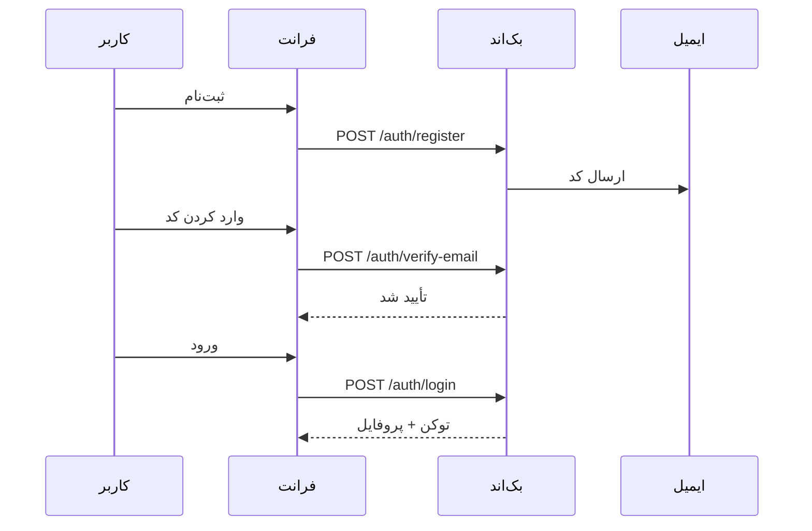
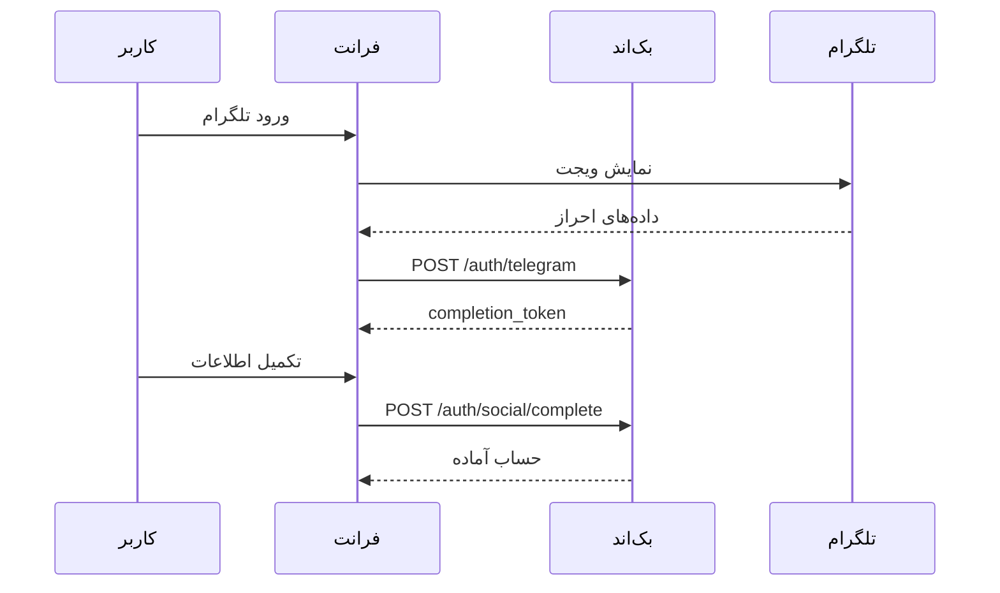
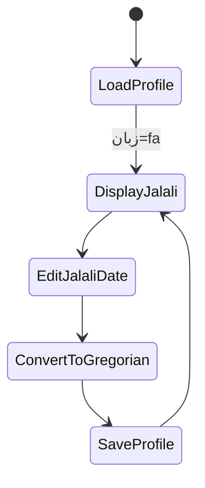
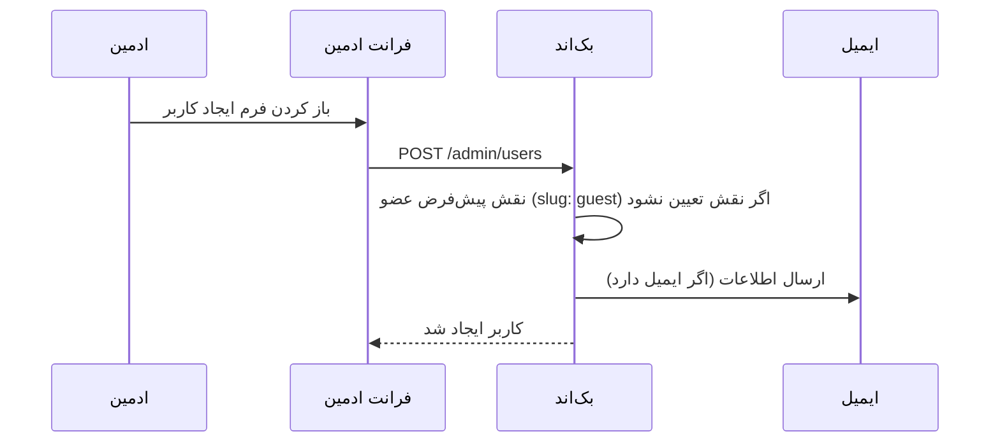

# راهنمای الزامات و معماری پروژه (FA)

> نکته: این سند الزامات اصلی و رفتار مورد انتظار پروژه را توضیح می‌دهد و شامل باگ‌فیکس‌ها یا تغییرات کوچک UI نیست.

---

## ۱) چشم‌انداز محصول
ساخت یک کار‌مدار مدرن و RTL‑اول برای مدیریت عمومی، با زبان فارسی (fa) به‌عنوان زبان اصلی و انگلیسی (en) به‌عنوان زبان دوم. فرانت‌اند با Angular (آخرین نسخه) و PrimeNG + Sakai Admin Template و Transloco. بک‌اند با Laravel و احراز هویت Sanctum.

## ۲) الزامات اصلی

### ۲.۱ زبان‌ها و جهت رابط
- زبان اصلی: فارسی (RTL)
- زبان دوم: انگلیسی (LTR)
- همه متن‌ها در فرانت و بک‌اند باید ترجمه شوند.
- مقدار `dir` و `lang` در HTML باید با تغییر زبان به‌روزرسانی شود.
- نمایش تاریخ: جلالی برای fa و میلادی برای en.
- نمایش اعداد: فارسی در fa و لاتین در en.

### ۲.۲ طراحی و تم
- رنگ و تم با لوگو هماهنگ باشد (logo_fa.png).
- کار‌مدار مدرن با استایل Sakai.
- دکمه‌ها، گرادیان‌ها، حاشیه‌ها و فیلدها از سیستم تم تبعیت کنند.

### ۲.۳ احراز هویت و چرخه حساب
- ورود با نام کاربری یا ایمیل + رمز عبور.
- ثبت‌نام با تأیید ایمیل (کد فعال‌سازی).
- فراموشی رمز و بازیابی.
- ورود بدون تأیید ایمیل ممنوع است (در صورت وجود ایمیل).
- ورود اجتماعی با تلگرام.
- در صورت ناقص بودن اطلاعات، تکمیل پروفایل الزامی است.
- امکان اتصال حساب تلگرام به حساب محلی موجود.

### ۲.۴ پروفایل و هویت
- مشاهده/ویرایش کامل پروفایل (اطلاعات شخصی، آواتار، شماره‌ها، آدرس‌ها).
- آپلود و حذف آواتار (Drag & Drop).
- تغییر رمز در مودال جداگانه.
- نمایش آیکن شبکه اجتماعی در پروفایل.
- اعتبارسنجی کد ملی و شبا.
- بررسی یکتایی نام کاربری و ایمیل به‌صورت زنده.

### ۲.۵ تاریخ جلالی
- ذخیره در بک‌اند به‌صورت میلادی.
- نمایش جلالی در حالت فارسی.
- امکان ورود تاریخ بدون صفر اولیه (مثلاً 1400/3/8).
- قوانین ماه‌های جلالی رعایت شود:
  - ماه‌های ۱ تا ۶ = ۳۱ روز
  - ماه‌های ۷ تا ۱۱ = ۳۰ روز
  - ماه ۱۲ = ۲۹/۳۰ روز
- هنگام ذخیره: تبدیل جلالی → میلادی.
- با تغییر زبان، نمایش تاریخ به‌روزرسانی شود.

### ۲.۶ کار‌مدار و نقش‌ها
- نقش‌ها و مجوزها:
  - ادمین: همه دسترسی‌ها
  - کاربر جدید: نقش پیش‌فرض عضو (slug: guest)
- CRUD برای کاربران، نقش‌ها و مجوزها.
- سایدبار واکنش‌گرا با گروه‌بندی منوها و آیکون‌ها.
- پشتیبانی کامل از RTL/LTR، جمع‌شونده در دسکتاپ و Overlay در موبایل.
- سایدبار با CSS سفارشی و بدون وابستگی به UI‑Framework پیاده‌سازی شود.
- در موبایل، دکمه منوی سایدبار کنار بنر قرار بگیرد و هدر هنگام اسکرول با افکت شیشه‌ای (Blur) ثابت شود.
- جدول‌ها با جستجو، مرتب‌سازی و صفحه‌بندی.
- ایجاد/ویرایش در مودال، حذف با تأییدیه.
- نمایش آیتم‌های منو بر اساس مجوز.

### ۲.۷ ایمیل و اعلان‌ها
- ایمیل‌ها فارسی/انگلیسی.
- ارسال کد فعال‌سازی و ریست رمز.
- ارسال ایمیل اطلاعات کاربر جدید توسط ادمین.
- پشتیبانی از Mailpit برای توسعه محلی (8025).

---

## ۳) داستان‌های کاربری مهم (با نمودار)

### ۳.۱ ثبت‌نام → تأیید ایمیل → ورود

### ۳.۲ ورود تلگرام → تکمیل پروفایل

### ۳.۳ ویرایش تاریخ تولد جلالی

### ۳.۴ ساخت کاربر توسط ادمین

---

## ۴) معماری

### ۴.۱ فرانت‌اند
- ساختار Feature محور:
  - `features/` برای صفحات و منطق هر بخش
- لایه Core:
  - `core/services` سرویس‌های API
  - `core/guards` گاردهای مسیر
  - `core/utils` ابزار تاریخ، اعتبارسنجی‌ها، error mapper
  - `core/interceptors` تزریق توکن
  - `core/config` پیکربندی API و Transloco
- کامپوننت‌های Shared:
  - کامپوننت‌های قابل استفاده مجدد (datepicker، modal و ...)

### ۴.۲ بک‌اند
- Controllers:
  - `AuthController` (احراز هویت + اجتماعی + ایمیل)
  - `ProfileController` (پروفایل کاربر)
  - `UserController` (CRUD ادمین + پروفایل ادمین)
- Services:
  - منطق ایمیل، توکن‌ها، و عملیات حساس در `app/Services`

---

## ۵) راهنمای توسعه
- فرانت‌اند: افزودن فیچر جدید در `features/` + سرویس در `core/services`.
- بک‌اند: افزودن کنترلر جدید + سرویس در `app/Services`.
- مجوز جدید: در Seeder اضافه شود و در UI/API لحاظ گردد.

